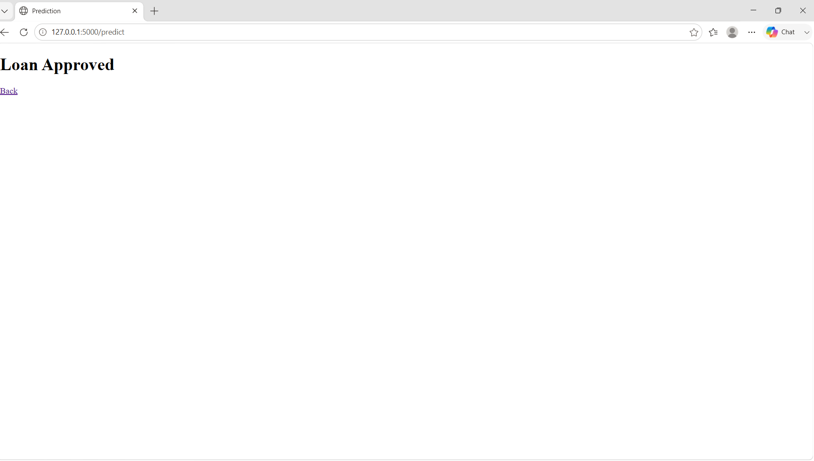
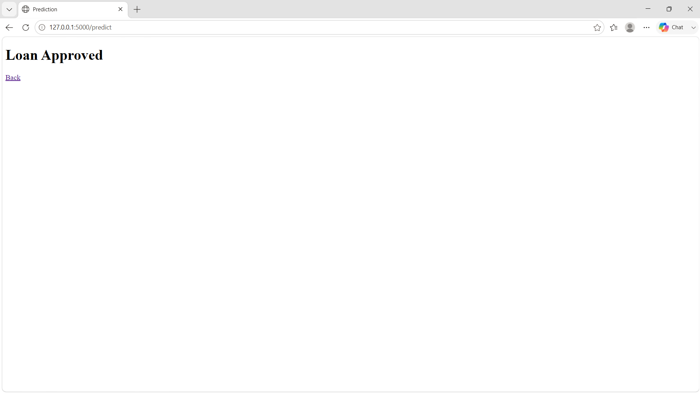
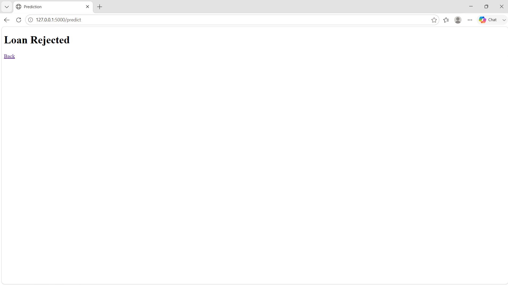

# 🏦 Smart Lender – AI-Powered Loan Approval Prediction


## 🌐 Live Demo

https://YOUR-RENDER-LINK.onrender.com

An AI-powered web application that predicts whether a loan application is likely to be **Approved** or **Rejected** using Machine Learning. The project is built with **Python**, **Flask**, **XGBoost**, and **Scikit-learn**, providing a simple and user-friendly interface for loan eligibility prediction.

---

## 📌 Project Overview

Smart Lender is a machine learning-based web application designed to assist banks and financial institutions in evaluating loan applications. Users can enter applicant details through a web interface, and the trained machine learning model predicts the loan approval status instantly.

The application uses an **XGBoost Classifier**, trained on historical loan data, to provide accurate predictions based on various applicant features.

---

## ✨ Features

- 🤖 AI-based loan approval prediction
- 🌐 User-friendly Flask web interface
- 📊 Machine Learning model using XGBoost
- 📁 Model saved using Joblib
- 🎨 Responsive web page with attractive UI
- ⚡ Fast prediction results
- 📈 Real-time loan approval decision

---

## 🛠️ Technologies Used

- Python
- Flask
- Pandas
- NumPy
- Scikit-learn
- XGBoost
- Joblib
- HTML5
- CSS3
- JavaScript

---

## 📂 Project Structure

```
Smart-Lender-ML-Project/
│
├── app.py
├── train_model.py
├── loan_prediction.csv
├── requirements.txt
├── Procfile
├── README.md
├── LICENSE
├── .gitignore
│
├── models/
│   ├── xgboost_model.pkl
│   └── label_encoders.pkl
│
├── templates/
│   ├── index.html
│   └── result.html
│
├── static/
│   ├── css/
│   │   └── style.css
│   ├── js/
│   │   └── script.js
│   └── images/
│       └── bank.jpg
│
└── screenshots/
    ├── home.png
    ├── prediction.png
    ├── approved.png
    └── rejected.png
```

---

## ⚙️ Installation

### 1️⃣ Clone the Repository

```bash
git clone https://github.com/Kavitha-2108/Smart-Lender-ML-Project.git
```

### 2️⃣ Navigate to Project Folder

```bash
cd Smart-Lender-ML-Project
```

### 3️⃣ Install Required Libraries

```bash
pip install -r requirements.txt
```

### 4️⃣ Run the Flask Application

```bash
python app.py
```

### 5️⃣ Open in Browser

```
http://127.0.0.1:5000
```

---

## 📊 Machine Learning Model

The project uses the **XGBoost Classifier** for loan approval prediction.

### Input Features

- Gender
- Married
- Dependents
- Education
- Self Employed
- Applicant Income
- Co-Applicant Income
- Loan Amount
- Loan Amount Term
- Credit History
- Property Area

### Output

- ✅ Loan Approved
- ❌ Loan Rejected

---

## 📷 Project Screenshots

### 🏠 Home Page


---

### 📋 Prediction Form



---

### ✅ Loan Approved



---

### ❌ Loan Rejected



---

## 🚀 Future Enhancements

- User Authentication
- Database Integration
- Loan History Management
- Admin Dashboard
- Email Notification
- PDF Report Generation
- Cloud Deployment
- Explainable AI (XAI)

---

## 👩‍💻 Author

**Kavitha Ankireddypalli**

GitHub:
https://github.com/Kavitha-2108

---

## 📜 License

This project is licensed under the **MIT License**.

---

## ⭐ Support

If you found this project useful, please consider giving it a ⭐ on GitHub.

